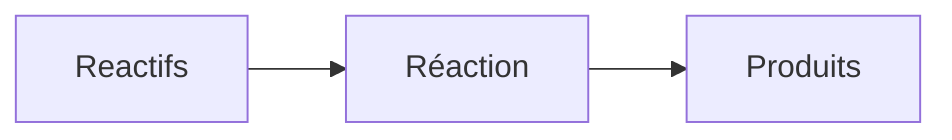

# Static School Knowledge Sheets — Project Specification

## 1. Project Goal

Build a **simple, static personal school knowledge website** using Astro and MDX.

The website should behave conceptually like a **beautiful file explorer for Markdown/MDX notes**:

- the folder structure defines the navigation;
- each `.mdx` file becomes a page;
- content is written mostly as normal Markdown;
- reusable semantic components can be inserted when special presentation is useful;
- pages should use space much better than Word or a traditional linear article;
- pages should be responsive on screens and cleanly printable;
- there is no user system, database, tracking, quiz engine, progress system, backend, or productivity dashboard.

The system is primarily a **renderer for a folder of structured school notes**.

The project content is the **curated, canonical knowledge base**. External
Obsidian vaults or document folders may contain research, drafts, attachments,
and unfinished writing, but they are not runtime dependencies. Material enters
this repository only when it is ready to become durable knowledge.

The important principle is:

> Content stays simple and semantic. Presentation is controlled globally by Astro components and CSS.

The reason for the project is that a Word-style document is unnecessarily
linear. Related definitions, formulas, examples, warnings, and diagrams should
be able to share the available screen or paper width. The engine—not the
author—must decide how many columns fit safely at each width.

If the visual design of a `Definition`, `Formula`, `CommonMistake`, etc. changes later, every page using that component should update automatically.

---

## 2. Technology

Use:

- Astro
- MDX
- TypeScript
- CSS
- KaTeX for mathematics
- Mermaid for diagrams
- SVG for custom diagrams
- Git
- GitHub Pages

The final website must compile to **100% static HTML/CSS/JS assets**.

No server runtime should be required.

---

## 3. Desired Simplicity

Do **not** introduce unnecessary architecture.

Do not add:

- databases;
- authentication;
- user accounts;
- permissions;
- progress tracking;
- spaced repetition;
- quizzes;
- revision history inside the application;
- dashboards;
- calendars;
- study logs;
- APIs;
- CMS systems;
- server-side storage;
- complicated metadata systems.

Git already provides version history.

The filesystem already provides organization.

Astro should mostly turn that filesystem into a pleasant website.

---

## 4. Content Structure

The basic structure should be extremely natural.

Example:

```text
src/
  content/knowledge/
    fr/
      math/
        suites.mdx
        fonctions.mdx
        geometrie/
          vecteurs.mdx

      chemistry/
        matiere.mdx
        atomes.mdx

    en/
      math/
        sequences.mdx

    uk/
      math/
        poslidovnosti.mdx
```

Each language is independent.

There is no requirement that every page exists in every language.

For example:

```text
/fr/math/suites/
/en/math/sequences/
```

may both exist, while no Ukrainian equivalent exists.

The folder tree itself should be sufficient to generate navigation.

---

## 5. File Explorer Philosophy

The user interface should feel closer to a **file explorer / documentation browser** than to a productivity application.

A simple layout could be:

```text
┌─────────────────────────────────────────────────────────┐
│ School Knowledge                              FR EN UK  │
├───────────────────┬─────────────────────────────────────┤
│                   │                                     │
│ Math              │  Suites arithmétiques               │
│ ├─ Suites         │                                     │
│ ├─ Fonctions      │  [page content]                     │
│ └─ Géométrie      │                                     │
│    └─ Vecteurs    │                                     │
│                   │                                     │
│ Chemistry         │                                     │
│ ├─ Matière        │                                     │
│ └─ Atomes         │                                     │
│                   │                                     │
└───────────────────┴─────────────────────────────────────┘
```

Desired qualities:

- simple;
- fast;
- obvious;
- minimal;
- keyboard-friendly if practical;
- no unnecessary home dashboard;
- folders and notes are the primary navigation model.

On mobile, the tree/sidebar may collapse into a drawer.

---

## 6. Navigation

Navigation should be generated automatically from `src/content/knowledge/`.

For example:

```text
src/content/knowledge/fr/math/suites.mdx
```

should create something like:

```text
/fr/math/suites/
```

and automatically appear under:

```text
FR
└── Math
    └── Suites
```

Nested folders should become nested navigation groups.

Example:

```text
src/content/knowledge/fr/math/geometrie/vecteurs.mdx
```

becomes:

```text
/fr/math/geometrie/vecteurs/
```

Navigation should ideally use file/folder names automatically, but frontmatter may optionally override display titles.

Example:

```yaml
---
title: Suites arithmétiques et géométriques
---
```

Keep frontmatter optional and minimal.

---

## 7. MDX Authoring Experience

MDX is the canonical source format, but notes should use a deliberately
portable subset of it:

- ordinary GitHub-flavoured Markdown for almost all prose;
- `$...$` and `$$...$$` LaTeX-style mathematics;
- a small, stable vocabulary of declarative semantic components;
- minimal frontmatter (`title` is optional; `order` may be used when needed).

Normal knowledge files should not contain application logic, component
imports, inline CSS, manual HTML layout, or arbitrary JavaScript. MDX is used
as an extension point, not as an invitation to write an application inside a
note.

The three levels of authoring are:

1. **Portable core:** Markdown, links, lists, tables, code, and mathematics.
2. **Stable semantics:** `Definition`, `Formula`, `Example`, `Note`, `Warning`,
   `CommonMistake`, `Summary`, `Grid`, `Mermaid`, and `Arrow`.
3. **Exceptional components:** reusable subject-specific elements added to the
   engine when ordinary semantics cannot express the idea.

Repeated custom ideas belong in engine components. Truly unique inline SVG is
allowed sparingly, provided it remains responsive and printable.

Most content should look like ordinary Markdown.

Example:

```mdx
# Suites arithmétiques

Une suite arithmétique est une suite dans laquelle on ajoute toujours
la même valeur.

<Definition title="Suite arithmétique">
Une suite est arithmétique lorsque la différence entre deux termes
consécutifs est constante.
</Definition>

<Formula>
u_n = u_0 + nr
</Formula>

<Example>
Si $u_0 = 3$ et $r = 4$, alors :

$$
3,\ 7,\ 11,\ 15,\dots
$$
</Example>

<CommonMistake>
Ne pas confondre l'indice $n$ avec la valeur $u_n$.
</CommonMistake>
```

The syntax should stay pleasant enough that writing a note does not feel like writing a React application.

Prefer:

```mdx
<Definition>
...
</Definition>
```

over verbose APIs with many required properties.

---

## 8. Semantic Components

Create a small set of reusable MDX components.

Initial useful set:

```text
Definition
Formula
Example
CommonMistake
Warning
Note
Summary
Method
Proof
Reference
Mermaid
SVGDiagram
Arrow
```

More components can be added later.

These components are **semantic**, not merely visual.

For example:

```mdx
<CommonMistake>
...
</CommonMistake>
```

means "this information represents a common mistake."

CSS decides whether that becomes:

- a red bordered card;
- an icon;
- a tinted background;
- a compact print block;
- something completely different later.

The MDX content should not care.

---

## 9. Custom Visual Elements

The author should be able to explicitly insert diagrams and visual structures when needed.

### Arrow

Example desired authoring syntax:

```mdx
<Arrow from="Force" to="Acceleration" />
```

or, if more flexible:

```mdx
<Arrow>
Force → Acceleration
</Arrow>
```

Implementation details can be decided pragmatically.

SVG is preferred for arrows.

---

### Mermaid

Example:

````mdx
<Mermaid>

</Mermaid>
````

The final implementation should make Mermaid easy to write inside MDX.

---

### SVG diagrams

Reusable Astro/MDX components may contain custom SVG diagrams.

Example:

```mdx
<ParticleModel type="solid" />
```

could be introduced later.

For unique diagrams, inline SVG should also be possible if Astro/MDX allows it cleanly.

SVG is preferred over raster graphics whenever practical because it scales and prints cleanly.

---

## 10. Mathematics

Use KaTeX.

Canonical Markdown/MDX math syntax should support:

```md
Inline: $a^2 + b^2 = c^2$

Display:

$$
a^2 + b^2 = c^2
$$
```

Math must render well:

- on desktop;
- on mobile;
- in print;
- inside semantic cards;
- inside grid layouts.

Long equations should not destroy the layout.

Horizontal scrolling inside an equation block is preferable to breaking the entire page width.

---

## 11. Main Visual Concept: Knowledge Grid

This is one of the most important parts of the project.

A school page should **not necessarily be one long vertical Word-like column**.

The content should be able to occupy available space intelligently using cards arranged in a responsive CSS Grid.

Example desktop page:

```text
┌──────────────────────────────────────────────────────┐
│ SUITES ARITHMÉTIQUES                                 │
│ Short introduction                                   │
└──────────────────────────────────────────────────────┘

┌──────────────────────┬───────────────────────────────┐
│ DEFINITION           │ INTUITION / NOTE              │
│                      │                               │
│ ...                  │ ...                           │
└──────────────────────┴───────────────────────────────┘

┌──────────────────────────────────────────────────────┐
│ FORMULA                                              │
│                   uₙ = u₀ + nr                       │
└──────────────────────────────────────────────────────┘

┌──────────────────────┬───────────────────────────────┐
│ EXAMPLE              │ DIAGRAM                       │
│                      │                               │
│ ...                  │ ...                           │
└──────────────────────┴───────────────────────────────┘

┌──────────────────────┬───────────────────────────────┐
│ METHOD               │ COMMON MISTAKE                │
│ ...                  │ ...                           │
└──────────────────────┴───────────────────────────────┘

┌──────────────────────────────────────────────────────┐
│ SUMMARY                                              │
└──────────────────────────────────────────────────────┘
```

This should behave responsively.

Desktop:

```text
2 or more columns where appropriate
```

Tablet:

```text
1–2 columns depending on available width
```

Mobile:

```text
mostly one column
```

Print:

```text
dense but readable A4-oriented layout
```

Nothing should rely on absolute positioning.

Cards should naturally reflow without overlapping or breaking.

---

## 12. Two Kinds of Content Flow

The system should support both:

### A. Normal Markdown flow

Useful for explanations:

```mdx
# Newton's laws

Introductory paragraph...

## First law

Text...

<Formula>
...
</Formula>
```

### B. Explicit grid sections

Useful for synthesis sheets.

For example:

```mdx
<Grid>
  <Definition>
    ...
  </Definition>

  <Example>
    ...
  </Example>

  <Formula wide>
    ...
  </Formula>

  <CommonMistake>
    ...
  </CommonMistake>
</Grid>
```

The exact API can be refined during implementation.

The important idea is that **the author may choose where a dense grid is useful instead of forcing the entire document into a grid**.

This avoids making long explanations awkward.

---

## 13. Grid API

A minimal possible API:

```mdx
<Grid>
  <Definition>
    ...
  </Definition>

  <Formula span="full">
    ...
  </Formula>

  <Example>
    ...
  </Example>

  <CommonMistake>
    ...
  </CommonMistake>
</Grid>
```

Or alternatively:

```mdx
<Grid>
  <GridItem span={6}>
    <Definition>...</Definition>
  </GridItem>

  <GridItem span={6}>
    <Example>...</Example>
  </GridItem>
</Grid>
```

Prefer the **simplest authoring experience** that still gives useful control.

Avoid making authors manually manage a 12-column grid unless necessary.

Good defaults are more important than maximum configuration.

Potential semantic sizing API:

```mdx
<Formula wide>
...
</Formula>

<Example compact>
...
</Example>
```

But do not over-engineer this before testing real notes.

---

## 14. Responsive Design

Components must adapt instead of relying on fixed dimensions.

Use modern CSS such as:

```css
grid-template-columns: repeat(auto-fit, minmax(...));
```

where appropriate.

Useful tools:

- CSS Grid;
- Flexbox;
- `minmax()`;
- `auto-fit`;
- `clamp()`;
- container queries if genuinely useful;
- sensible `overflow` behavior.

Avoid:

- absolute positioning for normal content;
- fixed card heights;
- assumptions about exact text length;
- layouts that only work at one screen width.

A definition containing five lines should not break because the example beside it contains fifteen.

---

## 15. Printable Layout

Printing is a first-class requirement.

A user should be able to press:

```text
Ctrl+P
```

and obtain a clean knowledge sheet.

Use CSS print styles:

```css
@media print {
    ...
}
```

Print mode should:

- hide navigation;
- hide unnecessary UI;
- remove screen-only decoration;
- preserve semantic visual distinctions;
- use page space efficiently;
- avoid awkward page breaks inside important cards when practical;
- keep formulas readable;
- keep SVG diagrams sharp;
- use an A4-friendly layout.

Useful CSS may include:

```css
break-inside: avoid;
page-break-inside: avoid;
```

but avoid creating huge blank areas merely to keep every block together.

The printable page should still benefit from the grid layout rather than becoming a giant single-column Word document unless the paper width requires it.

---

## 16. Editing Philosophy

The website itself does **not** need an editor.

"Editable" means the knowledge source remains easy to edit as `.mdx` files in a normal code/text editor such as:

- Neovim;
- VS Code;
- Zed;
- etc.

Workflow:

```text
edit MDX
    ↓
save
    ↓
Astro dev server updates
    ↓
commit to Git
    ↓
static site deploys
```

No browser-based WYSIWYG editor is needed.

---

## 17. Layouts

Keep layouts simple.

Suggested:

```text
src/layouts/
  KnowledgeLayout.astro
  PrintableLayout.astro   # only if actually necessary
```

It may even be better to use a single main layout plus print CSS rather than maintaining two independent renderers.

Use the simplest solution that avoids duplicated markup.

---

## 18. Styling

Suggested organization:

```text
src/styles/
  global.css
  typography.css
  components.css
  print.css
```

Or another similarly small structure.

Do not fragment CSS into dozens of files without a reason.

Global design should make all school subjects visually consistent.

Semantic components may have their own component-scoped styles if that is cleaner in Astro.

---

## 19. Design Direction

The visual design should feel like:

- a modern technical knowledge sheet;
- dense without being cramped;
- highly readable;
- clean;
- structured;
- calm;
- suitable both for studying on a monitor and printing.

Avoid the appearance of:

- a corporate dashboard;
- a task manager;
- a gamified learning app;
- a giant blog;
- Word documents pasted into HTML.

Cards should exist because they improve grouping, not because every sentence needs a rounded rectangle.

Whitespace should be deliberate, but page space should be used efficiently.

---

## 20. File and Folder Titles

Navigation should derive sensible labels automatically.

Example:

```text
suites-arithmetiques.mdx
```

may display as:

```text
Suites arithmetiques
```

But if frontmatter exists:

```yaml
---
title: Suites arithmétiques
---
```

use that.

Folders should also be humanized automatically:

```text
geometrie-analytique/
```

→

```text
Geometrie analytique
```

A future optional folder metadata mechanism may be added only if needed.

Do not require configuration files for every directory.

---

## 21. Language Handling

Top-level language directories:

```text
fr/
en/
uk/
```

Language switching should be simple.

Do **not** require translation IDs or synchronized translations initially.

If equivalent paths happen to exist, the switcher may try them.

Example:

```text
/fr/math/suites/
/en/math/suites/
```

If the target does not exist, simply go to the selected language root or corresponding subject folder.

Do not build a complex translation relationship system unless later proven necessary.

---

## 22. Suggested Astro Architecture

A plausible minimal project:

```text
src/
├── components/
│   ├── Definition.astro
│   ├── Formula.astro
│   ├── Example.astro
│   ├── CommonMistake.astro
│   ├── Warning.astro
│   ├── Note.astro
│   ├── Summary.astro
│   ├── Method.astro
│   ├── Proof.astro
│   ├── Reference.astro
│   ├── Grid.astro
│   ├── Mermaid.astro
│   ├── Arrow.astro
│   └── SidebarTree.astro
│
├── content/
│   ├── fr/
│   │   └── math/
│   │       └── suites.mdx
│   ├── en/
│   └── uk/
│
├── layouts/
│   └── KnowledgeLayout.astro
│
├── pages/
│   └── [...slug].astro
│
└── styles/
    ├── global.css
    ├── typography.css
    ├── components.css
    └── print.css
```

This is only a proposal.

If Astro Content Collections provide a cleaner current solution, use them.

The architectural objective matters more than preserving this exact tree.

---

## 23. Automatic MDX Components

Ideally common semantic components should be available inside every `.mdx` file without repeatedly importing them.

Desired authoring:

```mdx
<Definition>
...
</Definition>
```

rather than:

```mdx
import Definition from '../../../components/Definition.astro'
import Formula from '../../../components/Formula.astro'
import Example from '../../../components/Example.astro'
```

for every single note.

Research the cleanest supported Astro/MDX approach for globally exposing or conveniently mapping components.

If global injection is awkward or unsupported, create the least annoying alternative.

---

## 24. Example Complete Page

A real file such as:

```text
src/content/knowledge/fr/math/suites.mdx
```

could contain:

```mdx
---
title: Suites
---

# Suites

Une suite est une succession ordonnée de nombres.

<Grid>
  <Definition title="Suite">
    Une suite numérique associe à chaque entier $n$ un nombre $u_n$.
  </Definition>

  <Note title="Notation">
    $u_n$ désigne le terme de rang $n$.
  </Note>
</Grid>

## Suites arithmétiques

<Grid>
  <Definition>
    Une suite est arithmétique lorsque la différence entre deux termes
    consécutifs est constante.
  </Definition>

  <Formula wide>
    $$
    u_{n+1} = u_n + r
    $$

    $$
    u_n = u_0 + nr
    $$
  </Formula>

  <Example>
    Si $u_0 = 3$ et $r = 4$ :

    $$
    3,\ 7,\ 11,\ 15,\ 19,\dots
    $$
  </Example>

  <CommonMistake>
    $n$ est l'indice. $u_n$ est la valeur du terme.
  </CommonMistake>
</Grid>

## Suites géométriques

<Grid>
  <Definition>
    Une suite est géométrique lorsque chaque terme est obtenu en
    multipliant le précédent par une constante $q$.
  </Definition>

  <Formula wide>
    $$
    u_{n+1} = q u_n
    $$

    $$
    u_n = u_0 q^n
    $$
  </Formula>
</Grid>

<Summary>
- Arithmétique → addition constante.
- Géométrique → multiplication constante.
</Summary>
```

This example captures the intended balance:

- normal Markdown remains available;
- semantic cards are easy to use;
- grids are explicit where useful;
- formulas work naturally;
- the source remains readable even without rendering.

---

## 25. Component Behavior

Semantic components should share consistent behavior.

A generic card may internally provide:

```text
icon / label
optional title
content
```

For example:

```text
┌───────────────────────────────┐
│ DEFINITION                    │
│ Suite arithmétique            │
│                               │
│ Une suite ...                 │
└───────────────────────────────┘
```

But components may differ visually.

Possible categories:

```text
Definition       neutral/informational
Formula          strong mathematical emphasis
Example          practical
CommonMistake    warning/error
Warning          high attention
Summary          concluding emphasis
Method           procedural
Proof            formal reasoning
Note             secondary information
```

Do not hard-code these meanings into MDX pages using raw colors.

Use semantic CSS classes or component implementations.

---

## 26. Adaptability

The project should make later visual redesign easy.

For example, changing:

```text
Definition.astro
```

should update every definition everywhere.

Changing:

```text
Grid.astro
```

should allow the entire synthesis layout philosophy to evolve without rewriting notes.

Changing typography should happen globally.

A page should contain **meaning**, not layout hacks.

Bad:

```mdx
<div style="background:#234; width:47%; margin-left:2%">
```

Good:

```mdx
<Definition>
...
</Definition>
```

Likewise, avoid embedding presentation-specific HTML in the knowledge files unless it is genuinely the most practical way to express a unique diagram.

---

## 27. Performance

The site should remain extremely lightweight.

Prefer:

- static rendering;
- CSS;
- Astro components;
- SVG;
- small client-side scripts only when required.

Avoid shipping a large client-side framework merely for navigation or cards.

Mermaid may require JavaScript, but only load what is necessary.

The basic knowledge page should remain usable even with minimal JavaScript.

---

## 28. Offline Use

Offline use is desirable but not part of the initial implementation.

The static output itself should already be easy to serve locally.

Do not introduce a service worker or PWA architecture in the first version unless it is nearly free and cannot complicate the project.

---

## 29. GitHub Pages

The finished project should deploy cleanly to GitHub Pages.

Requirements:

- static build;
- correct Astro `site` / `base` handling if required;
- relative/base-aware asset paths;
- GitHub Actions workflow if useful;
- no server dependencies.

Keep deployment separate from the content architecture.

---

## 30. Initial Implementation Scope

Build only the useful foundation.

### Phase 1

Implement:

1. Astro project;
2. MDX support;
3. KaTeX;
4. automatic routing from the content tree;
5. automatically generated sidebar tree;
6. language roots;
7. main responsive layout;
8. print CSS;
9. `Grid`;
10. these semantic components:

```text
Definition
Formula
Example
CommonMistake
Note
Warning
Summary
```

11. one Mermaid component;
12. one simple Arrow/SVG component;
13. one realistic example note.

Do not add anything beyond this unless it is technically required.

---

## 31. First Test Content

Use a mathematics page such as `fr/math/suites.mdx` as the first serious test.

It should test:

- headings;
- paragraphs;
- lists;
- inline math;
- display math;
- multiple grid cards;
- a full-width formula;
- cards with very different text lengths;
- a Mermaid diagram;
- an SVG/arrow;
- print output;
- mobile layout.

The implementation should be judged against a **real note**, not an artificial component showcase.

---

## 32. Acceptance Criteria

The first version is successful if all of the following are true.

### Content

I can create:

```text
src/content/knowledge/fr/math/suites.mdx
```

write ordinary Markdown plus semantic components, and the page appears automatically.

### Navigation

The file appears automatically in the sidebar according to its directory.

### Styling

I can modify the appearance of all definitions by editing one component/style.

### Grid

I can arrange related blocks into a compact grid without manually positioning them.

The same content rearranges safely on smaller screens.

### Math

KaTeX works inside ordinary Markdown and semantic components.

### Diagrams

I can easily insert Mermaid and SVG-based visual elements.

### Print

`Ctrl+P` produces a clean printable page without the sidebar.

### Static

`astro build` produces a fully static site deployable to GitHub Pages.

### Simplicity

Adding a normal school note should require little or no configuration outside the `.mdx` file itself.

---

## 33. Content and Component Contract

Every engine component that can appear in a note must:

- work both inside and outside `Grid`;
- size itself from its container rather than the viewport;
- avoid fixed heights and normal-flow absolute positioning;
- contain long text, code, mathematics, and media without widening the page;
- collapse cleanly to one column when space is insufficient;
- have a readable print representation;
- avoid requiring client-side JavaScript unless its purpose genuinely needs it.

`Grid` provides useful automatic placement and a small amount of semantic
control such as `wide`/full-width. Notes must never manage columns with inline
styles, pixel widths, or presentation-specific wrappers.

## 34. Source Lifecycle

```text
Obsidian vault / documents
        research, drafts, raw references
                    ↓ editorial promotion
repository MDX
        curated canonical knowledge
                    ↓ static build
study website / printable knowledge sheets
```

Copying from a draft into the repository is an editorial decision, not an
automatic synchronization requirement. The published knowledge must build
without access to the external vault or document folder.

---

# 33. Core Design Rules

When making architectural decisions, prefer these rules in this order:

1. **Simple authoring is more important than framework cleverness.**
2. **Filesystem structure is the main information architecture.**
3. **MDX files are the source of truth.**
4. **Semantic components describe meaning rather than appearance.**
5. **CSS Grid should use page space efficiently.**
6. **Layouts must adapt instead of depending on fixed dimensions.**
7. **Printing is part of the design, not an afterthought.**
8. **Everything should remain static unless there is a compelling reason otherwise.**
9. **Avoid configuration that can be inferred automatically.**
10. **Do not build features before there is a real need for them.**

---

# 34. What This Project Is Not

This is **not**:

- Notion;
- Obsidian Sync;
- Moodle;
- Anki;
- a school planner;
- a learning management system;
- a CMS;
- a dashboard;
- a note database.

It is closer to:

> **a custom static renderer for a directory of beautifully structured MDX school knowledge sheets.**

The filesystem organizes the knowledge.

MDX expresses it.

Semantic components give recurring concepts consistent presentation.

Astro renders it.

CSS Grid makes it spatial rather than unnecessarily linear.

Print CSS turns the same knowledge into a useful physical sheet.

That is the project.
