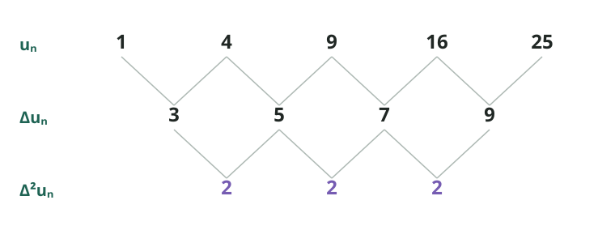

# Suites numériques

Une suite numérique est une liste ordonnée de nombres. Ici, le premier terme
est $t_1$ et les rangs commencent à $1$.

<Grid title="Notation et conventions">
  <Definition title="Terme et rang">
    Dans $t_n$, la lettre $t$ désigne un **terme** et $n$ indique sa place,
    appelée son **rang**. Ainsi, $t_4$ est le terme de rang $4$.

    - Voir aussi les [ensembles et symboles logiques](./ensembles-de-nombres.mdx).
  </Definition>

  <Definition title="Formule de récurrence">
    Elle donne un terme à partir du terme précédent. Il faut aussi connaître
    le premier terme. Par exemple :
    $$t_1=3 \qquad\text{et}\qquad t_{n+1}=t_n+4.$$
    On obtient successivement $3,7,11,15,\ldots$
  </Definition>

  <Definition title="Formule du terme général">
    Elle permet de calculer directement le terme de n'importe quel rang sans
    calculer les précédents. Par exemple :
    $$t_n=4n-1,$$
    donc $t_{10}=4\times10-1=39$.
  </Definition>

  <Warning title="Convention de départ">
    Certains cours commencent à $t_0$. Il faut alors adapter les formules :
    $t_n=t_0+nr$ et $t_n=t_0q^n$.
  </Warning>
</Grid>

<Grid title="Suites arithmétiques et géométriques">

  <Definition title="Suite arithmétique">
    Sa **raison** $r$ est la différence constante entre deux termes
    consécutifs : $r=t_{n+1}-t_n$.
  </Definition>

  <Formula title="Formules arithmétiques">
    $$t_{n+1}=t_n+r$$
    $$t_n=t_1+(n-1)r=an+b$$
    avec $a=r$ et $b=t_1-r$.
  </Formula>

  <Example title="Différence constante">
    Pour $3,7,11,15,19,\ldots$, on a $r=4$ et $t_1=3$, donc
    $$t_n=3+4(n-1)=4n-1.$$
  </Example>

  <Definition title="Suite géométrique">
    Sa raison multiplicative $q$ est le quotient constant de deux termes
    consécutifs : $q=\frac{t_{n+1}}{t_n}$, lorsque $t_n\ne0$.
  </Definition>

  <Formula title="Formules géométriques">
    $$t_{n+1}=qt_n$$
    $$t_n=t_1q^{n-1}$$
  </Formula>

  <Example title="Rapport constant">
    Pour $3,6,12,24,48,\ldots$, on a $q=2$, donc
    $$t_n=3\cdot2^{n-1}.$$
  </Example>
</Grid>

<Grid title="Différences constantes et degré">
  <Definition title="Premières différences">
    On soustrait chaque terme au suivant :
    $$\Delta t_n=t_{n+1}-t_n.$$
    Si elles sont constantes et non nulles, la suite est de degré $1$.
  </Definition>

  <Definition title="Deuxièmes différences">
    On recommence sur la ligne des premières différences :
    $$\Delta^2t_n=\Delta t_{n+1}-\Delta t_n.$$
    Si cette ligne est constante et non nulle, tandis que la première ne
    l'était pas, la suite est de degré $2$.
  </Definition>

  <Definition title="Différences d'ordre k" wide>
    On répète la soustraction jusqu'à obtenir une ligne constante. Si la
    première ligne constante et non nulle est $\Delta^k t_n$, la suite
    polynomiale est de degré $k$.
  </Definition>

  <DataTable title="Motifs polynomiaux" wide compact lines="rows">

    | Différence constante | Type | Forme générale |
    | --- | --- | --- |
    | valeurs $t_n$ | constante, degré 0 | $t_n=c$ |
    | $\Delta t_n$ | linéaire, degré 1 | $t_n=an+b$ |
    | $\Delta^2t_n$ | quadratique, degré 2 | $t_n=an^2+bn+c$ |
    | $\Delta^3t_n$ | cubique, degré 3 | $t_n=an^3+bn^2+cn+d$ |
    | $\Delta^k t_n$ | polynomiale, degré $k$ | $t_n=a_kn^k+\cdots+a_0$ |

  </DataTable>

  <SVGDiagram caption="Triangle des différences de la suite des carrés" wide>

    

  </SVGDiagram>

  <Example title="Carrés parfaits">
    Pour $1,4,9,16,25,\ldots$, les premières différences sont
    $3,5,7,9,\ldots$ et les deuxièmes différences valent toujours $2$.
    La suite est quadratique : $t_n=n^2$.
  </Example>

  <Formula title="Coefficient quadratique">
    Si $t_n=an^2+bn+c$, alors
    $$
    \Delta^2t_n=2a \qquad\Longrightarrow\qquad
    a=\frac{\Delta^2t_n}{2}.
    $$
    Deux autres termes permettent ensuite de déterminer $b$ et $c$.
  </Formula>

  <Warning>
    La méthode des différences constantes ne reconnaît pas une suite
    géométrique : ses différences ne deviennent pas constantes indéfiniment.
    Il faut tester les quotients séparément.
  </Warning>
</Grid>

<Grid title="Fiche source">
  <Image caption="Fiche récapitulative originale utilisée comme référence" wide>

    scp -r /home/iwakur/music/* iwakur@192.168.1.22:/srv/navidrome/music/[Fiche résumant les suites arithmétiques, géométriques et polynomiales.](../../../img/fiche-suites-numeriques.png)

  </Image>
</Grid>

<Grid>
  

  1. Chercher une différence constante : elle indique une suite polynomiale.
  2. Sinon, chercher un rapport constant : il indique une suite géométrique.
  3. Une formule du terme général donne directement $t_n$; une récurrence
     utilise les termes précédents.

  

</Grid>
